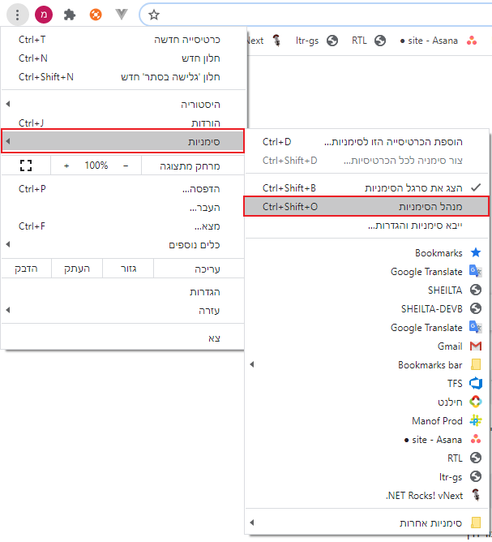
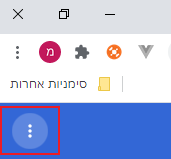
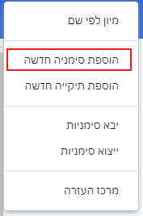
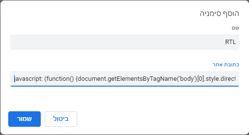
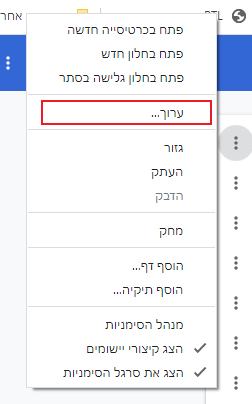

לא פעם קורה שאנחנו רוצים לתקן את התצוגה באתר לא שלנו.

לדוגמא: השתמשנו בתרגום לעברית של גוגל, אבל כל האתר מוצג משמאל לימין.

למי שמכיר, לא מדי מסובך לפתוח את כלי הפיתוח של הדפדפן (F12) ולשנות את קוד ה-css לפי הצורך.

אבל כל פעם מחדש? נו, באמת.

הטריק הבא יאפשר לכם להריץ קוד בלחיצה על סימניה.

מה הקוד יעשה? כל מה שקוד js יכול לעשות.

לחצו על לחצן שלוש הנקודות בצד ובחרו בתפריט _סימניות_ -> _מנהל הסימניות_.



לחצו על לחצן שלוש הנקודות (הפעם של מנהל הסימניות) ובחרו בתפריט _הוספת סימניה חדשה_




כאן יש להגדיר את שם הסימניה (יוצג בחוץ על הלחצן) ובמקום כתובת האתר לכתוב את הקוד הרצוי.

נתחיל עם קוד שמסדר את יישור הטקסט מימין לשמאל.

העתיקו את הקוד שלהלן בלחיצה על לחצן _copy_ בצד ימין והדביקו בשדה _כתובת האתר_
```js
javascript: (function() {document.getElementsByTagName('body')[0].style.direction = 'rtl';document.getElementsByTagName('body')[0].style.textAlign = 'right'})();
```

<Primary>
 זוהי פונקציה רגילה של js, רק חשוב לשים לב לעטוף אותה ב:javascript וסוגריים
</Primary>



שמרו וזהו. הסימניה נוספה לבר הסימניות של הדפדפן.

אם אתם לא מוצאים אותה בחוץ, כנראה שיש לכם מדי הרבה סימניות.

 פתחו את מנהל הסימניות והעבירו את הסימניה לתחילת הרשימה.

כדי לערוך את הסימניה לחצו עליה לחיצה ימנית ובחרו בתפריט _ערוך_.


לקוראי הפוסט של מייל אוטומטי עם קובץ מצורף, הנה הקוד שיסדר את עורך הסקריפטים של גוגל.

(ולא, הקוד שלמעלה לא יעזור, גוגל רוצים שתקדישו להם סימניה מיוחדת...)

```js
javascript: (function() {document.getElementsByClassName('CodeMirror-lines')[0].style.direction = 'ltr';})();
```
<Primary>
קוד זה מטפל רק בקובץ הראשון שפתוח בעורך הסקריפטים.

אם יש לכם כמה קבצים תצטרכו לשים לב להשאיר תמיד רק אחד פתוח.

במחשבה שניה, אם יש לכם כמה קבצים, כנראה שתוכלו לשדרג את הקוד הזה בעצמכם...
</Primary>

<Info>
בונוס לסיום:

[אתר נחמד](https://mrcoles.com/bookmarklet) שמציע ממשק לייצור סימניות.

</Info>