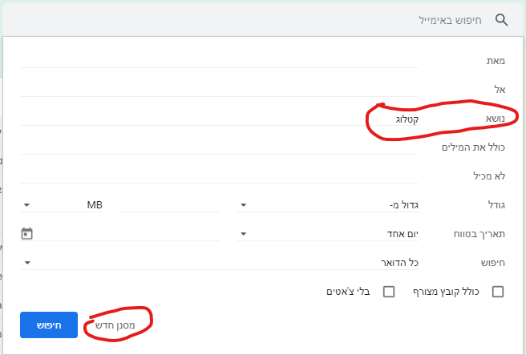
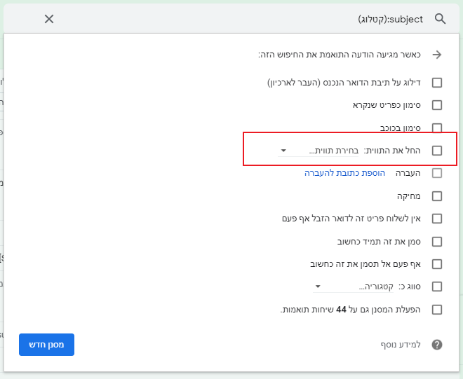
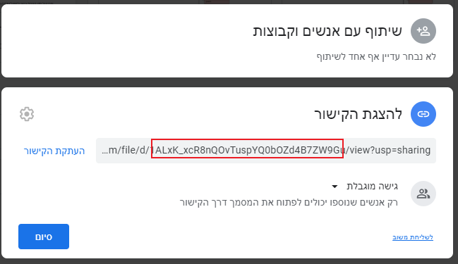
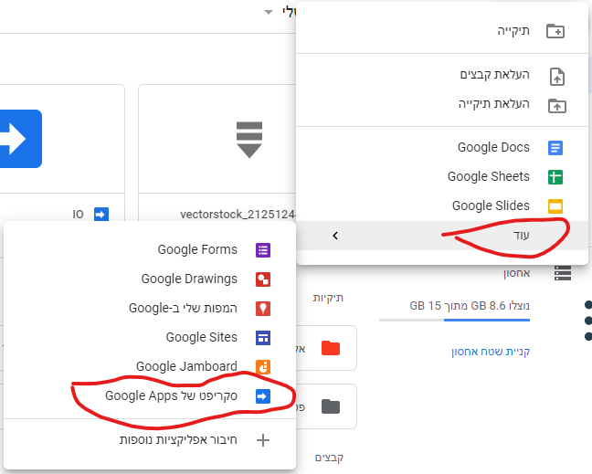
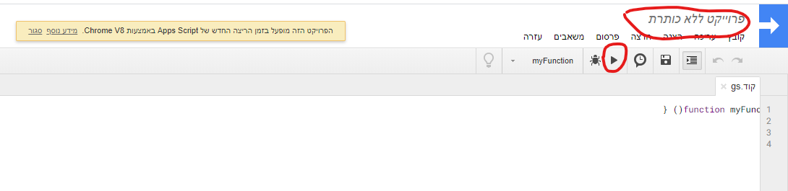
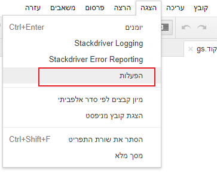
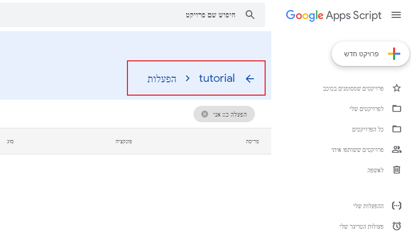
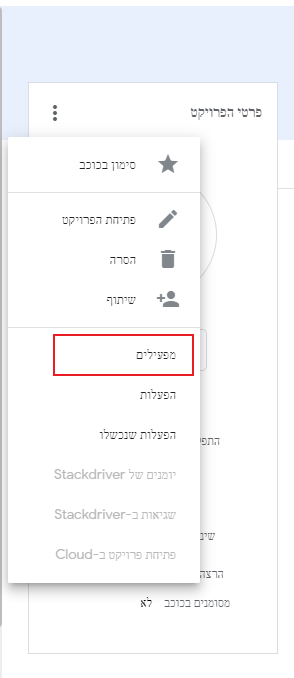

רוצים לשלוח מייל תשובה אוטומטי עם קובץ מצורף?

אם ניסיתם פעם וראיתם שאין אפשרות כזו בג'ימייל, הפוסט הזה הוא בדיוק בשבילכם!

באמצעות כמה הגדרות ועוד כמה שורות קוד - גם המייל שלכם יידע לעשות את העבודה.

ידע קודם נדרש:

ג'ימייל ודרייב.

אה, וגם העתק הדבק
🥰

אז מה אנחנו הולכים לעשות?

1. ניצור מסנן שיתייג בתווית יעודית את ההודעות הנכנסות הרלוונטיות.
2. ניצור קובץ pdf בדרייב. הקובץ הזה ישלח במענה האוטומטי.
3. ניצור סקריפט בדרייב שיעבור על כל ההודעות בתווית ויבצע מענה עם הקובץ שיצרנו.
4. נגדיר טריגר (מפעיל) לסקריפט שיריץ אותו כל דקה.

על הדרך נלמד טיפ נחמד איך לסדר את עורך הסקריפטים של גוגל שמתבלבל בין ימין לשמאל בדפדפן עברי.

אז קדימה.

## 1. יצירת מסנן
צרו מסנן עבור כל ההודעות שהנושא שלהן הוא _קטלוג_.



הגדירו תווית חדשה בשם _new-mail_


## 2. יצירת קובץ PDF
העלו קובץ מסוג PDF לדרייב.

לחצו על הקובץ לחיצה ימנית ובחרו בתפריט _קבלת קישור שניתן לשתף_.

העתיקו את הקישור ושמרו אותו בצד בינתיים. בהמשך ניקח ממנו את המזהה של הקובץ.


## 3. יצירת סקריפט
היכנסו לדרייב, לחצו על חדש -> עוד -> סקריפט של Google Apps.


נפתח לנו טאב חדש עם עורך הסקריפטים של גוגל.

ראשית תנו לפרויקט שם כרצונכם במקום _פרויקט ללא כותרת_


החליפו את הקוד הקיים בקוד הזה:
```js
var file = DriveApp.getFileById('file_id').getAs('application/pdf')

function reply() {
  var label = GmailApp.getUserLabelByName('new-mail');
  var messages = label.getThreads();
  for(var i=0;i<messages.length;i++){
    messages[i].reply('attached',{
    attachments:[file]
  });
    messages[i].removeLabel(label);
  }
}
```

בשורה הראשונה של הקוד, החליפו את _file_id_ במזהה קובץ ה-PDF ששמרתם בצד.

שמרו בלחיצה על _שמור_ או ctrl+s.

הריצו בלחיצה על המשולש (מסומן בצילום מסך שלעיל)

תקפוץ לכם הודעה שנדרשת הרשאה. לחצו על _סקור הרשאות_.

תדרשו לבחור את החשבון שבו הסקריפט ירוץ, ומכיוון שהסקריפט לא מאומת על ידי גוגל, תופיע הודעה _האפליקציה הזו אינה מאומתת_.

לחצו על _מתקדם_ ואחר כך על _כניסה אל... (לא מאובטח)_

לאחר מכן יופיעו הפעולות שהסקריפט מבקש לקבל עבורן הרשאה. לחצו על _אישור_.
<Primary>
יתכן שהודעה זו תוקפץ שוב בהמשך אם הסקריפט ישתנה וידרוש הרשאות נוספות.
</Primary>

## 4. יצירת מפעיל






